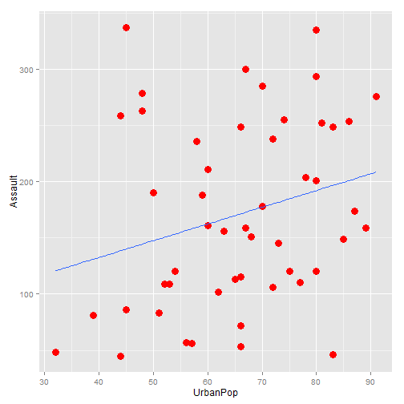

Exploration and prediction of crime rates.
========================================================

Author: Rakesh Muralidharan

Date: 24-May-2015

Description:
========================================================


- This is a reproducible pitch to the project done with Shiny for Developing Data Products course.

- The project accesses the "USArrests" data set which measures violent crime rates (per 100,000) for US states by percent of urban population. 

- The Shiny application can be accessed through the following hyperlink on ShinyServer

https://rakeshmuralidharan.shinyapps.io/App-1/

Instructions:
========================================================


- Following are the instructions for using the Shiny app mentioned in the previous slide.

- From the first sidebar drop down menu, select the crime type - Murder, Assault or Rape. This will reactively plot the selected crime rate vs. urban population percent (default is Murder).

- Next from the second slidebar option select the value of urban population for which you want the model to predict the crime rate. This will run a simple regression of selected crime rate with urban population as independent variable and print out the predicted crime rate.

- Further down the page you will see the ui.R and server.R files and some descriptions. Enjoy!


Sample plot found on Shiny application
========================================================

- Here is a sample plot for Assault vs. Urban Population with a regression line.


 


Sample regression run on the Shiny application
========================================================

- Here is a sample regression run on the Shiny app. This one regresses Assault with urban population percent.


```r
regfit = lm(Assault ~ UrbanPop, data=USArrests)
coef(regfit)
```

```
(Intercept)    UrbanPop 
   73.07658     1.49044 
```


